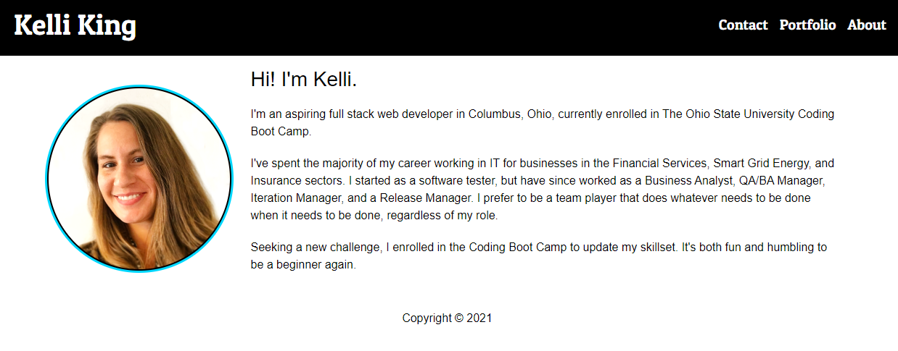

# Bootcamp Homework 20 - React: Portfolio

## Description
This is a coding bootcamp homework assignment to  update my existing portfolio using [React](https://reactjs.org/).  React Router is used for navigation through the portfolio components and the code is deployed to GitHub Pages.  

## Table of Contents
* [Usage](#Usage)
* [Contributing](#Contributing)
* [Questions](#Questions)
* [Acknowledgements](#Acknowledgements)
* [License](#License)

## Usage
The [Portfolio](https://thorgriffs.github.io/react-portfolio/) runs in the browser.    

## Contributing
Fork the repo and submit a pull request to enhance the code or fix a bug

## Questions
Have questions?  Contact me on [GitHub](https://github.com/thorgriffs) or email <22.kelliking@gmail.com>

## Acknowledgements
This project was bootstrapped with [Create React App](https://github.com/facebook/create-react-app).

I referenced the [React JS Crash Course](https://youtu.be/w7ejDZ8SWv8) tutorial from [Traversy Media](https://www.youtube.com/channel/UC29ju8bIPH5as8OGnQzwJyA) for help with structure and style.

## License

[MIT](https://github.com/thorgriffs/react-portfolio/blob/main/LICENSE) License

Copyright (c) 2021 Kelli King